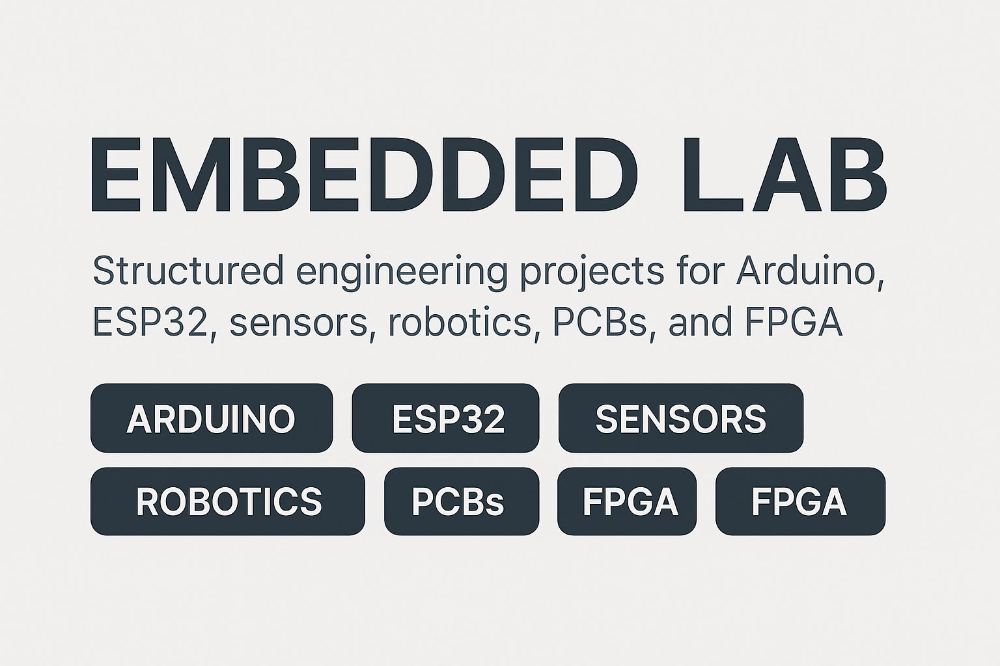

# 🔧 Embedded Systems & Electronics Lab  
*A Hands-On Engineering Journey: Arduino • ESP32 • IoT • Sensors • Robotics • PCB Design • FPGA*

<p align="center">
  
</p>

## 📘 Overview  
This repository documents my **complete embedded systems engineering lab**, where I explore:

- **Electronics fundamentals**
- **Arduino UNO R4 WiFi development**
- **ESP32 IoT systems**
- **Sensor interfacing**
- **Wireless communication**
- **Robotics**
- **Embedded system design**
- **PCB design using KiCad**
- **FPGA + digital logic (Verilog)**

The goal is to build a strong, industry-standard engineering portfolio while mastering practical embedded systems skills.

---

## 📅 90-Day Roadmap  
This lab is structured into phases designed to build expertise progressively:

### **Days 1–5 — Electronics Basics**
- Breadboards, LEDs, resistors  
- Voltage & current measurement  
- Diodes, transistors, MOSFETs  
- Capacitors & RC circuits  
- Logic analyzer fundamentals  

### **Days 6–15 — Arduino Basics (UNO R4 WiFi)**
- Digital I/O  
- PWM & analog reading  
- Serial communication  
- Relays, buzzers  
- DAC, OP AMP, LED matrix  
- Mini alarm system project  

### **Days 16–30 — Sensors & Displays**
- Analog sensors (LDR, temp, sound)  
- Digital sensors (IR, tilt, hall)  
- Rotational sensors (encoder, joystick)  
- Keypads, LCD1602, 7-segment  
- Home dashboard project  

### **Days 31–45 — ESP32 IoT & Networking**
- WiFi + web servers  
- MQTT communication  
- BLE  
- Cloud uploads (Firebase/AWS)  
- Smart home ESP32 system  

### **Days 46–60 — Real Embedded Systems**
- Power regulation  
- Level shifting  
- RTOS concepts  
- FreeRTOS tasks  
- PID motor control  
- Environmental monitoring system  

### **Day 60+ — Robotics / PCB / FPGA**
- Autonomous robot navigation  
- Line following + obstacle avoidance  
- KiCad PCB designs (sensor boards, regulators)  
- FPGA Verilog: UART, counters, FSMs, RISC-V soft core  

---

## 📁 Repository Structure  

```text
embedded-lab/
├── electronics-basics/        # Days 1–5
├── arduino-basics/            # Days 6–15
├── sensors-displays/          # Days 16–30
├── esp32-iot/                 # Days 31–45
├── embedded-systems/          # Days 46–60
├── robotics/                  # Day 60+
├── pcb-design/                # KiCad projects, Gerbers, schematics
├── fpga/                      # Verilog experiments, softcore CPU
├── docs/                      # Documentation
│   ├── roadmap/               # Full roadmaps
│   └── datasheets/            # Component datasheets
├── wiring-diagrams/           # Fritzing schematics
├── notes/                     # Concept explanations
├── .github/workflows/         # CI tools
├── README.md                  # You are here
├── .gitignore
└── banner.png
